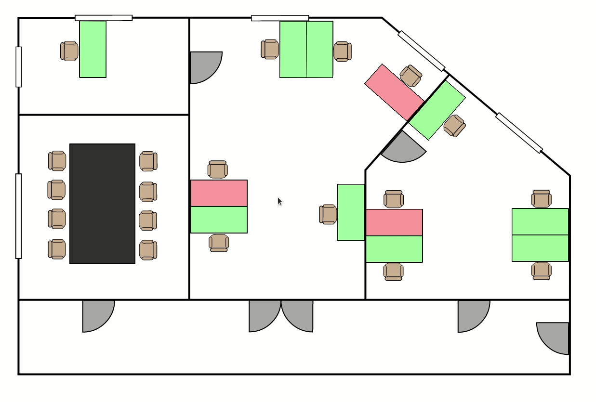

# WASM SVG Map Drawer

Draw an interactive map based on a `.svg` with WASM code running in a web
worker. Can be used to show e.g. occupied/reserved desks in an office.



## Build & Run

- You need [Rust][rust-install] and [`wasm-pack`][wasm-pack-install] installed
  on your machine.

```bash
# Build the project
./build.sh

# Serve the web folder, e.g. with python
python3 -m http.server --bind 127.0.0.1
```

## Background

This is an exploratory, PoC-level project looking at the basis for a scalable
solution to drawing an interactive map.

### Requirements

The requirements taken into account were:

- The map should be created with a GUI-drawing software. Anything else is not
  scaleable when creating larger maps.
- Specific shapes on the map should be clickable. A click should return the ID
  of the shape that was clicked. This could be used to redirect to a details
  page or to open a configuration modal.
- Hovering over clickable shapes should indicate that they are clickable for
  usability.
- (Re-)drawing the map should not impact much the responsiveness of the main
  UI interface.

### Approach

- To enable drawing the map with a GUI software, we choose SVG as the basis of
  the map. For the attached example, we used [Inkscape][inkscape].
- We want to avoid redrawing a lot of static content on every re-render. Also,
  we want to keep the SVG instructions understandable by our drawer as minimal
  as possible. As a solution, we embed the original SVG as `` and overlay
  a [HTML5 canvas][html5-canvas] on top of it.
- The performance requirements are tackled in several ways:
  - Obviously, just drawing the dynamic, changing part of the map compared to
    always drawing the whole map is a lot more performant.
  - To keep the main UI interface responsive, we offload the drawing to a
    separate thread using a [`WebWorker`][web-worker].
    - To render a canvas in a web worker, we need to transfer the control and
      create a [`OffscreenCanvas`][offscreen-canvas].
  - We separate evaluating which shapes are highlighted / pointed to from
    drawing them to avoid unnecessary redraws.
  - The mouse movement updates the current mouse position, which is periodically
    sent to the worker thread to evaluate if the actively-pointed-to shape
    changed.
  - Our drawing logic is written in [WebAssembly][wasm] with Rust, executing at
    near-native speed. Note that this advantage is not playing out that much
    since we barely have compute-heavy code and a lot of API calls which
    ultimately go through the JS VM.

### Further Information

- To create the fade-in/fade-out effect with the canvas, we draw with an alpha
  value of `0.2` in a loop for ten steps and `50ms` timeout. By slowly
  overwriting what was shown before, we give the impression of a fade.
- Currently, the mouse position for the hover effect is only sent every `250ms`.
  If you want to trade some compute for responsiveness, you can reduce the
  value.
- We can send all/specific `states` (at the moment `i32` values) for every shape
  and reference [`fillStyle`][fill-style]s to our worker. In a production
  context, clients could retrieve current states from a backend and the map
  would be rendered accordingly. In this example, we show an office floor plan
  where you could e.g. show reserved/occupied desks, but this could also be used
  for floor plans of hotels etc.
- SVG instructions can state absolute or relative coordinates, but the
  [`Context` API][ctx-api] expects always absolute values. We use a helper
  function to transform all coordintates to absolute values before drawing them.
- We send the mouse position as relative value on the canvas element to avoid
  issues with the different scales between the HTML element and the drawing
  buffer. Note that the element size of the canvas and of the image background
  still have to agree.
- Maybe obvious for seasoned web developers: You should create the drawing
  context only _once_ in the worker, otherwise the canvas will reset.
- This was developed with Firefox. At first glance, it does not look the same
  on Chrome (re-rendering in a loop is not done / optimized out?). Also, this is
  not ready for mobile.

### Create your own map

- In theory, most `.svg` files should work, however this was tested with
  [Inkscape][inkscape] in version `0.92.5 (2060ec1f9f, 2020-04-08)`.
- Any shape that should be dynamic has to be a `path` and cannot be something
  like a `rect` etc.
- Dynamic shapes must have their `ID` starting with `dynamic` - only those paths
  are extracted by the drawer when parsing the `.svg` file.
- There cannot be two shapes with the same `ID` (does SVG even allow this?).
- For some reason, Inkscape sometimes adds a layer transform. This has to be set
  to zero, probably in the generated file on a text-level. E.g.:

```xml
  <g
     inkscape:label="Floorplan"
     inkscape:groupmode="layer"
     id="layer1"
     transform="translate(0,0)">      <!-- zero transform -->
    <path
```

[rust-install]: https://www.rust-lang.org/tools/install
[wasm-pack-install]: https://rustwasm.github.io/wasm-pack/installer/
[inkscape]: https://inkscape.org
[html5-canvas]: https://developer.mozilla.org/en-US/docs/Web/API/Canvas_API
[web-worker]: https://developer.mozilla.org/en-US/docs/Web/API/Web_Workers_API
[offscreen-canvas]: https://developer.chrome.com/blog/offscreen-canvas/
[wasm]: https://webassembly.org/
[fill-style]: https://developer.mozilla.org/en-US/docs/Web/API/CanvasRenderingContext2D/fillStyle
[ctx-api]: https://developer.mozilla.org/en-US/docs/Web/API/CanvasRenderingContext2D
